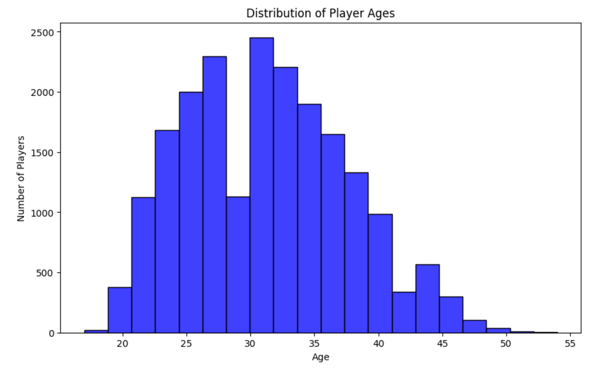
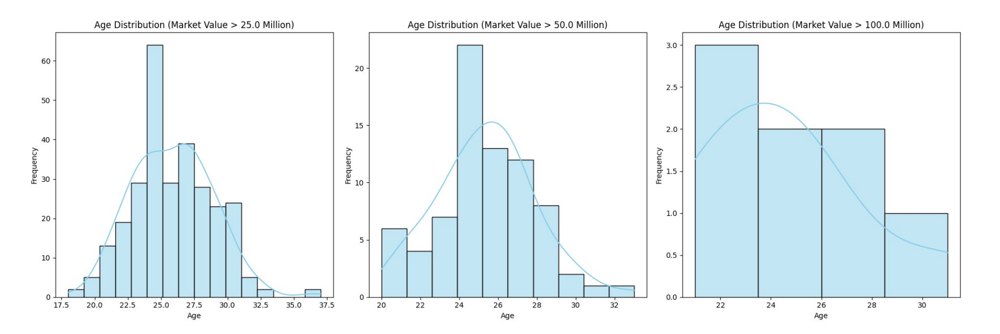
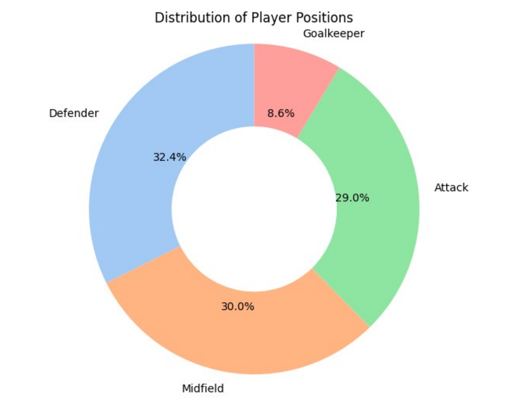
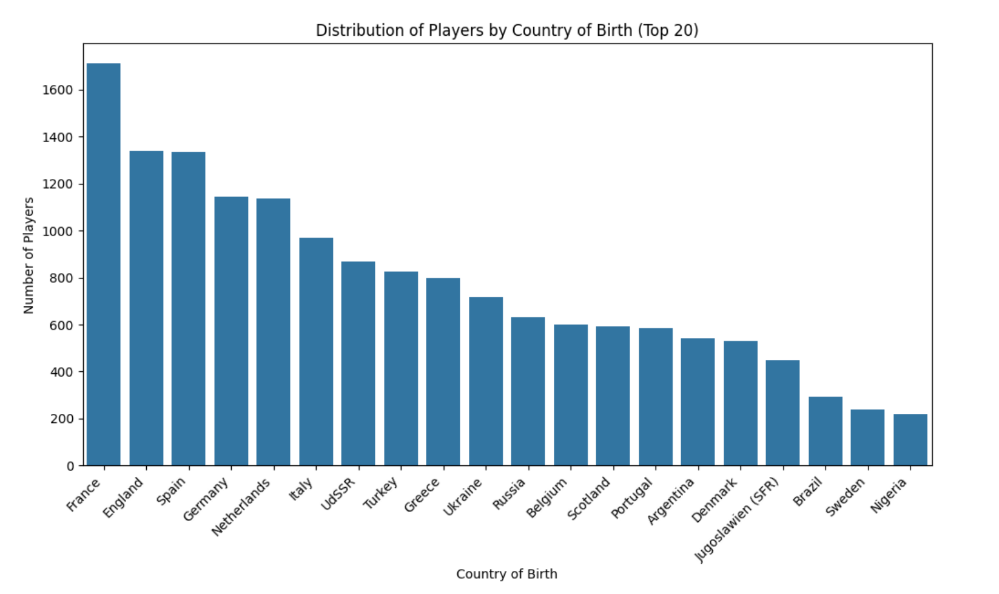
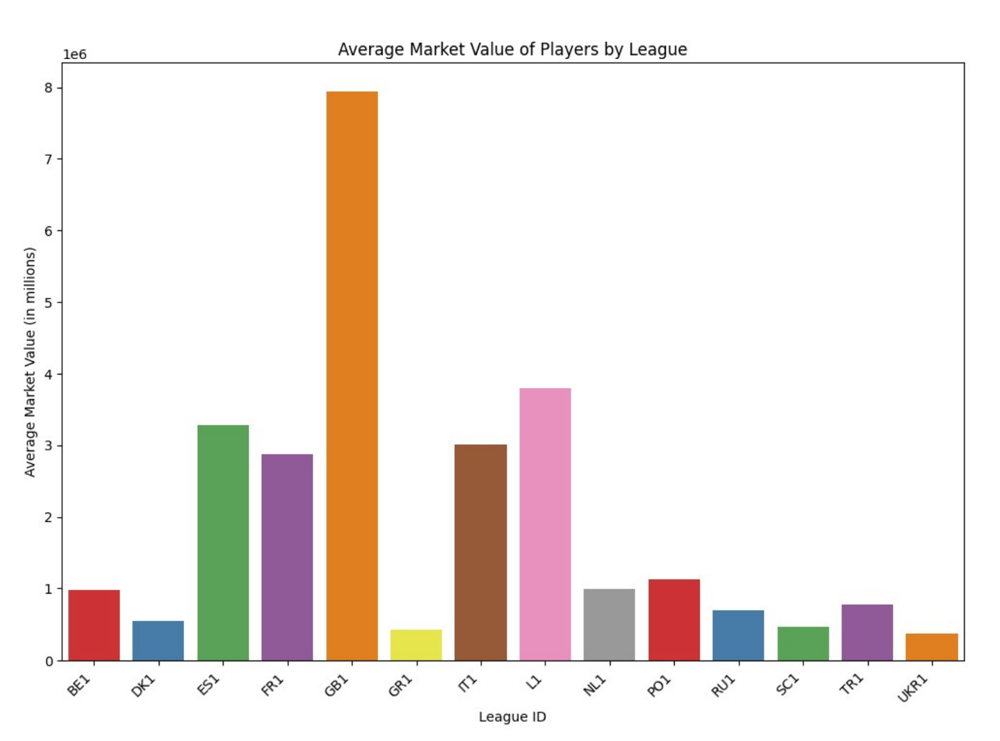
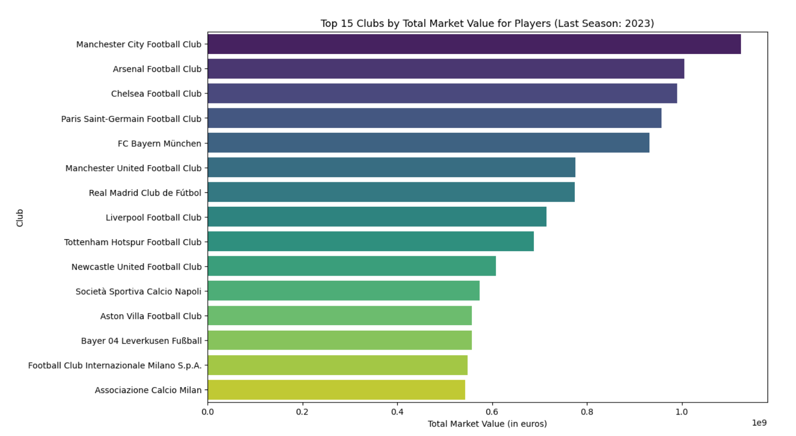
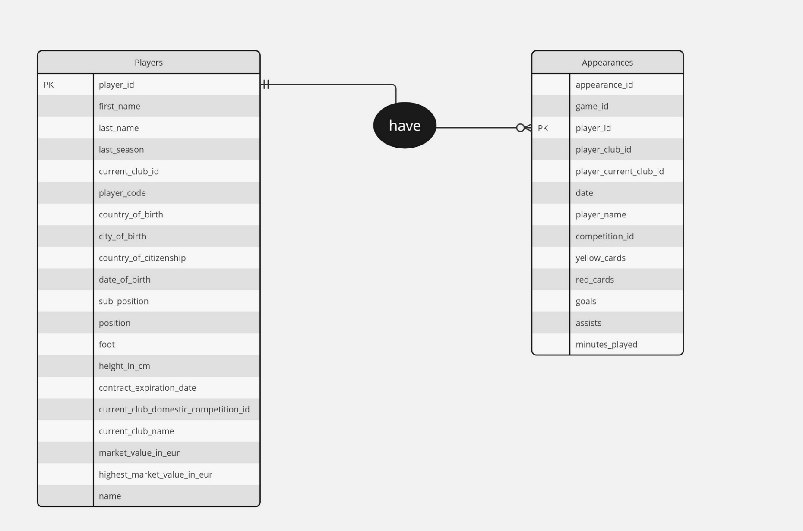

# ⚽ Soccer Player Analytics: Unveiling Insights into Performance and Market Trends

Welcome to my **Soccer Data Analysis** project! This repository dives deep into football statistics to uncover intriguing insights about player performance, market trends, and league dynamics. Explore how data shapes the game and tells compelling stories about the beautiful sport.

---

## 📌 Project Highlights

- **Data Source**: Dataset from [Transfermarkt](https://www.transfermarkt.com), a soccer statistics platform. Includes information on players, their clubs, market values, goals, and more.
- **Motivation**: Driven by a passion for soccer, this project provides data-driven insights to enthusiasts and analysts alike.
- **Dataset Coverage**:
  - 30,328 players
  - 1,515,723 appearances
  - Statistics include player heights, ages, market values, cards, and minutes played.

---

## 📊 Key Insights

### **1. Age Distribution**
The peak ages for soccer players are **27–32**, aligning with prime performance years.

---

### **2. Market Value Analysis**
- Average market value: **€1.6 million**
- Players valued over **€100 million** are predominantly younger (around 22 years old), reflecting the growing emphasis on potential.

---

### **3. Positional Trends**
The distribution of player positions reveals that **goalkeepers** are the least represented, while **midfielders** dominate.

---

### **4. Top Nations**
European countries dominate the player pool, with **France** leading, followed by **England** and **Spain**.

---

### **5. League Trends**
- **English Premier League** boasts the highest average player market value.
- **La Liga** records the most yellow cards per game, reflecting stricter officiating.

---

### **6. Club Dominance**
- **Manchester City** holds the highest squad market value.
- **Chelsea** has the youngest squad among the most valuable clubs.

---

## 🔧 Methodology

### **Exploratory Data Analysis**
- **Libraries Used**: `pandas`, `seaborn`, `matplotlib`, `numpy`
- Data cleaning, imputation, and visualization techniques were employed to derive insights.

### **Entity Relationship Diagram**

- **Players** table linked to **Appearances** table (one-to-many relationship).

### **Data Cleaning Highlights**
- Missing values in critical columns like `foot` and `contract_expiration_date` were imputed using probabilistic techniques.
- Removed columns with more than 50% missing data, e.g., `agent_name`.

---

## 📈 Future Scope

- **Machine Learning**: Build predictive models for player market values using historical data and gameplay metrics.
- **Expanded Metrics**: Include advanced statistics like passing accuracy, defensive actions, and goal contributions.
- **Interactive Dashboards**: Develop a Streamlit-based application for real-time soccer analytics.

---

## 🚀 Challenges Faced

1. Lack of **historical market value data** limited trend analysis.
2. Absence of **detailed gameplay metrics** restricted advanced model building.

---

## 📜 References

- Dataset: [Transfermarkt](https://www.transfermarkt.com)
- Additional Analysis: Kaggle's Player Scores Dataset ([link](https://www.kaggle.com/datasets/davidcariboo/player-scores))

---

## 🎯 Get Involved

This repository is a living project, and contributions are welcome! Feel free to fork, create pull requests, or open issues for discussions.

---
